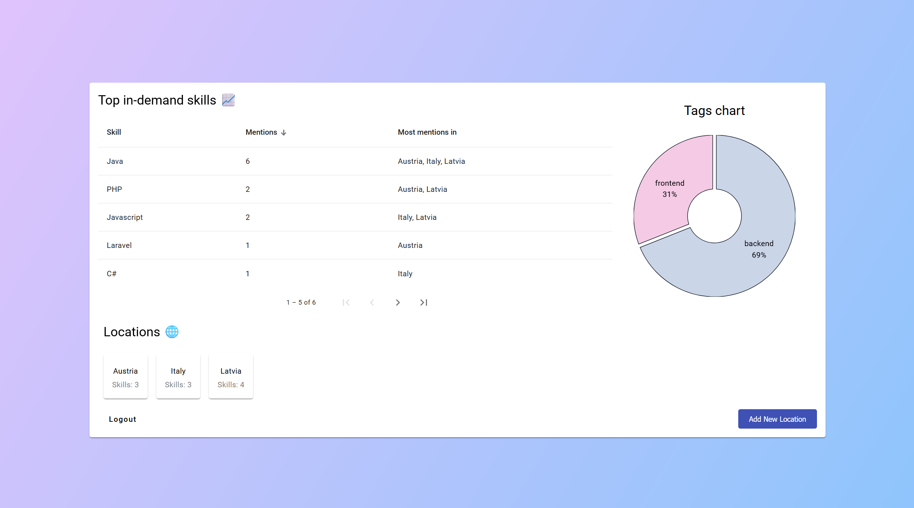

# 📊 In-Demand Skills Tracker (Frontend repo)

A full-stack application that helps users explore and manage the most sought-after tech skills by location/company.

# 🌐 Live demo
A live version can be found [here](https://vermillion-khapse-9e6bb3.netlify.app).

# 🚦 Deploy status

# 🛠️ Technologies used

## 🎨 Frontend
- Built with **Angular** and styled using **Angular Material**
- Authenticates to backend using JWT
- Route guards to prevent address tampering
- Allows users to view, add, update, and manage skills and locations/companies
- Supports upvoting skills to reflect their demand
- Features data visualizations with **D3.js** for clear insight into trends
- Hosted on **Netlify**

## ⚙️ Backend
- Developed with **Node.js** and **Express**
- Provides secure APIs for authentication using **JWT**
- Handles skill/user management through RESTful endpoints
- Data stored in **MongoDB** database
- Backend and database hosted on **Railway**
- Find the backend repo [here](https://github.com/dividedby-0/in-demand-skills-tracker-backend)

# 🚀 Future plans
- [ ] Add a skill search feature to allow users to find skills by name or location/company.

# 📝 License
This project is licensed under the [MIT License](https://github.com/dividedby-0/in-demand-skills-tracker-frontend/blob/main/LICENSE).
